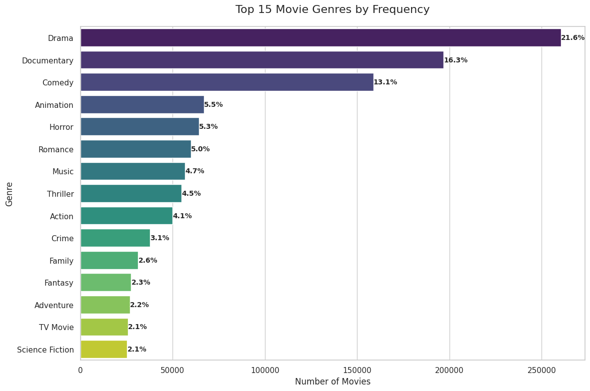
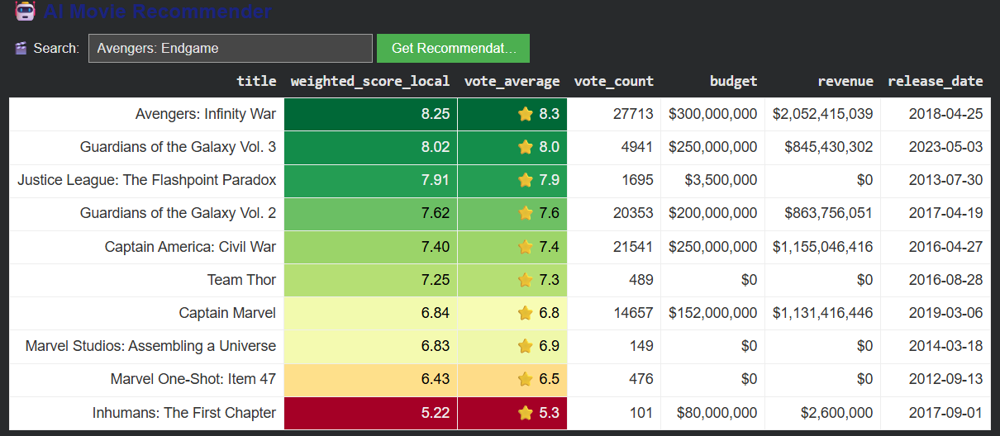
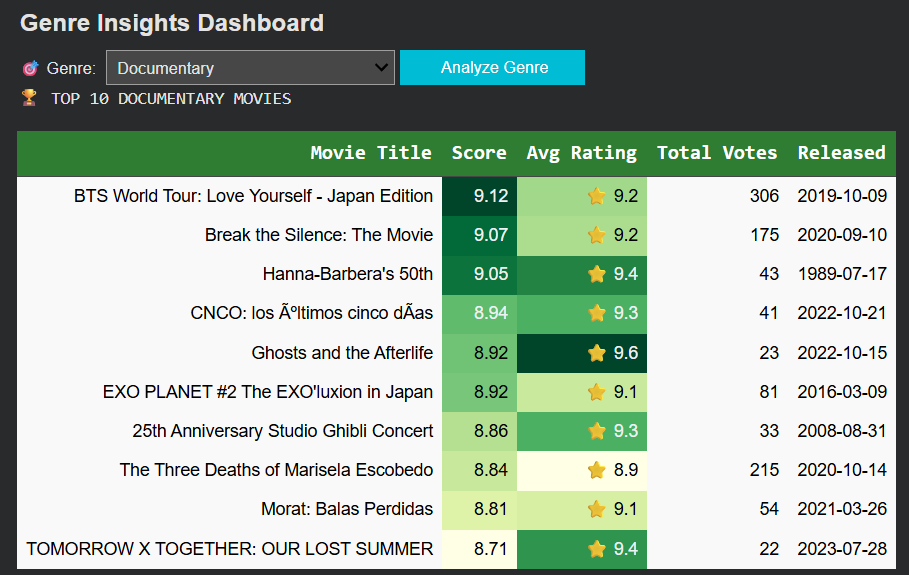

# 🎬 Movie Recommendation System (TMDB)

[](https://www.python.org/)
[](https://scikit-learn.org/)
[](https://pandas.pydata.org/)

An end-to-end AI-powered recommendation engine utilizing the **TMDB dataset (1M+ movies)**. This project implements a hybrid approach combining statistical weighting with Natural Language Processing (NLP) to provide high-quality movie suggestions.

---

## 🚀 Project Overview
The system addresses the "cold start" and "popularity bias" problems by offering three distinct ways to discover content:

1. **Content-Based Filtering**: Finds movies similar in theme and description using NLP.  
2. **Weighted Rating System**: A statistical model that balances average rating with vote count.  
3. **Interactive Discovery**: Dynamic dashboards for real-time genre and metadata exploration.  

---

## 🛠️ Technical Architecture

### 1. Data Engineering & Processing
To handle the scale of 1,000,000+ records, the pipeline includes:

- **Robust Ingestion**: Parsing large CSVs with `latin1` encoding and error-handling for inconsistent line breaks.  
- **Metadata Soup**: A unified feature vector created by merging `genres`, `keywords`, and `overviews` to capture the "DNA" of a movie.  

---

### 2. The Recommendation Engines

#### **A. Content-Based Filtering**
We utilize **TF-IDF (Term Frequency-Inverse Document Frequency)** to vectorize movie descriptions and calculate **Cosine Similarity** between them.

---

#### **B. IMDb Weighted Rating**

To prevent movies with a single 10/10 rating from topping the charts, we implement the IMDb formula:

```

W = (v / (v + m) * R) + (m / (v + m) * C)

````

| Variable | Description |
|----------|-------------|
| **v** | Number of votes for the movie |
| **m** | Minimum votes required to be listed (90th percentile) |
| **R** | Average rating of the movie |
| **C** | Mean vote across the dataset |


---

## Genres in the Dataset 



## 🎬 Search by Movie Name



## 🎬 Search by Genre (Output)



``` If the user wishes to view a film from the provided list, they may copy and paste the title into the field below to access the full movie information. ```

## 🎬 Output Screen:

🎥 Movie Metadata Explorer
Movie Name: Avengers: Infinity War  

============================================================  

🎬 MOVIE DETAILS: AVENGERS: INFINITY WAR  
 
===========================================================

Tagline:        An entire universe. Once and for all.  
Genres:         Adventure, Action, Science Fiction  
Release Date:   2018-04-25  
Runtime:        149 mins  
Rating:         8.255 (27713 votes)  
Weighted Scr:   8.25  
Budget:         $300,000,000  
Revenue:        $2,052,415,039  
Status:         Released  

OVERVIEW:  
As the Avengers and their allies have continued to protect the world from threats too large for any one hero to handle, a new danger has emerged from the cosmic shadows: Thanos. A despot of intergalactic infamy, his goal is to collect all six Infinity Stones, artifacts of unimaginable power, and use them to inflict his twisted will on all of reality. Everything the Avengers have fought for has led up to this moment - the fate of Earth and existence itself has never been more uncertain.  

==============================================================================


---

## 📊 Key Features & Visualizations

- **Interactive Dashboards**: Built with `ipywidgets`, enabling real-time recommendations without coding.  
- **Genre Analytics**: Market share visualization using **Treemaps** (highlighting dominant genres like Drama and Documentary).  
- **Metadata Explorer**: Insights into financial performance (Budget vs Revenue) and production trends.  

---

## 📦 Tech Stack

- **Language**: Python  
- **ML/NLP**: `scikit-learn` (TF-IDF, Cosine Similarity)  
- **Data Analysis**: `pandas`, `numpy`  
- **Visualization**: `matplotlib`, `seaborn`, `squarify`  
- **UI/UX**: `ipywidgets`  

---

## ⚙️ Installation & Usage

### 1. Clone the Repository
```bash
git clone https://github.com/your-username/movie-recommender.git
cd movie-recommender
````

### 2. Install Dependencies

```bash
pip install -r requirements.txt
```

### 3. Run the Notebook

Open `movie_recommender.ipynb` in Jupyter Notebook or VS Code and run all cells to launch the interactive system.

---

## 📈 Future Roadmap

* [ ] Integrate live TMDB API for real-time updates
* [ ] Implement Collaborative Filtering using SVD
* [ ] Deploy as a web app using Streamlit

---

## 👤 Author

**Vignesh M**

## 🎥 Dataset

TMDB 5000 / 1M Movie Dataset

```
https://www.kaggle.com/datasets/asaniczka/tmdb-movies-dataset-2023-930k-movies
```
